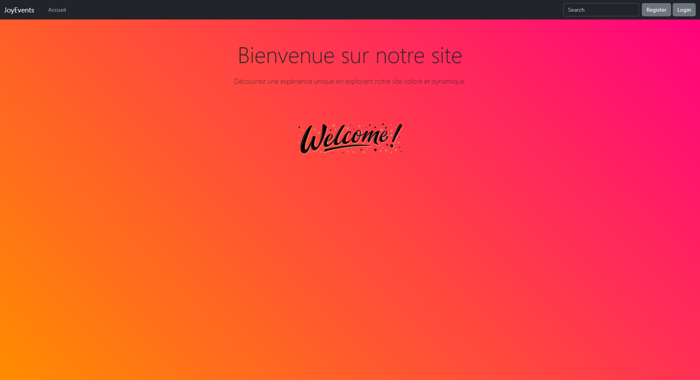
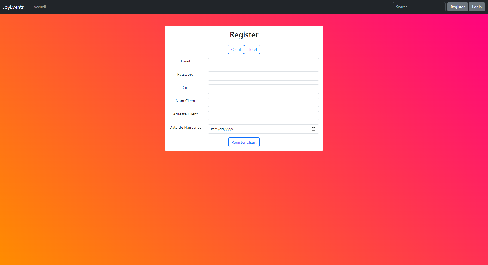
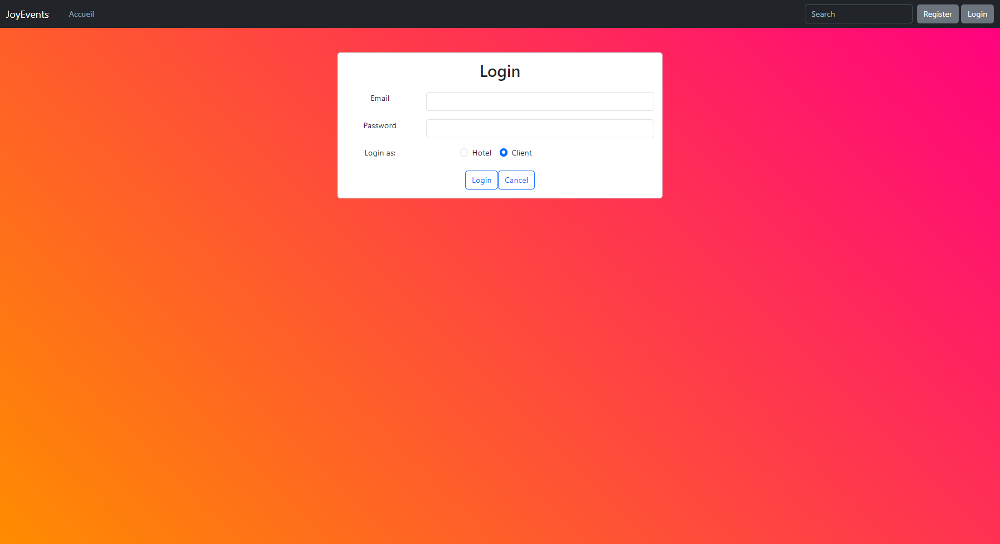
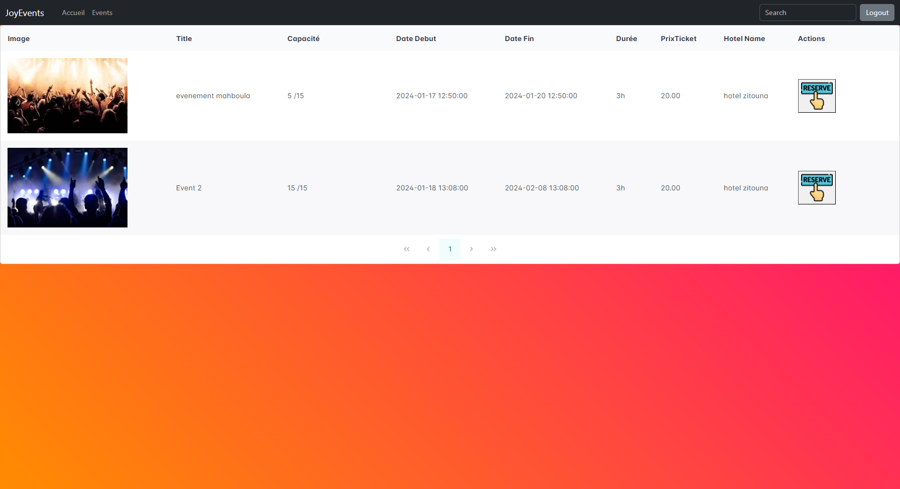
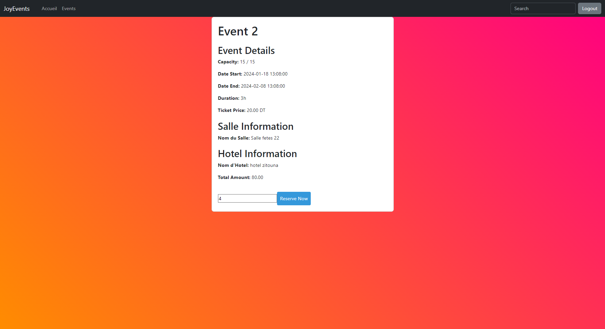
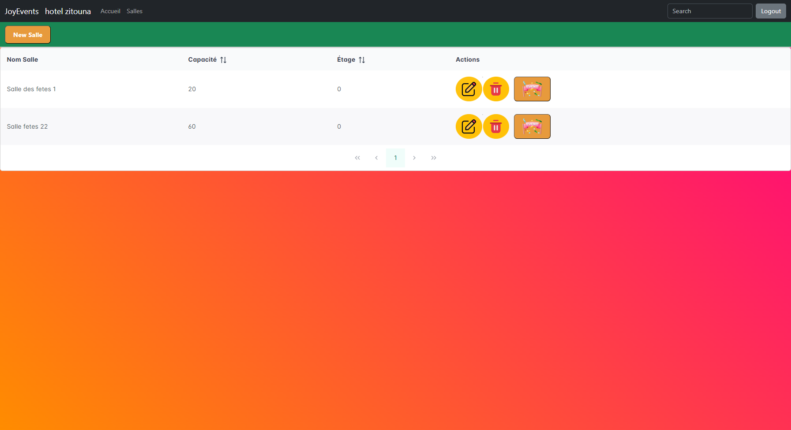
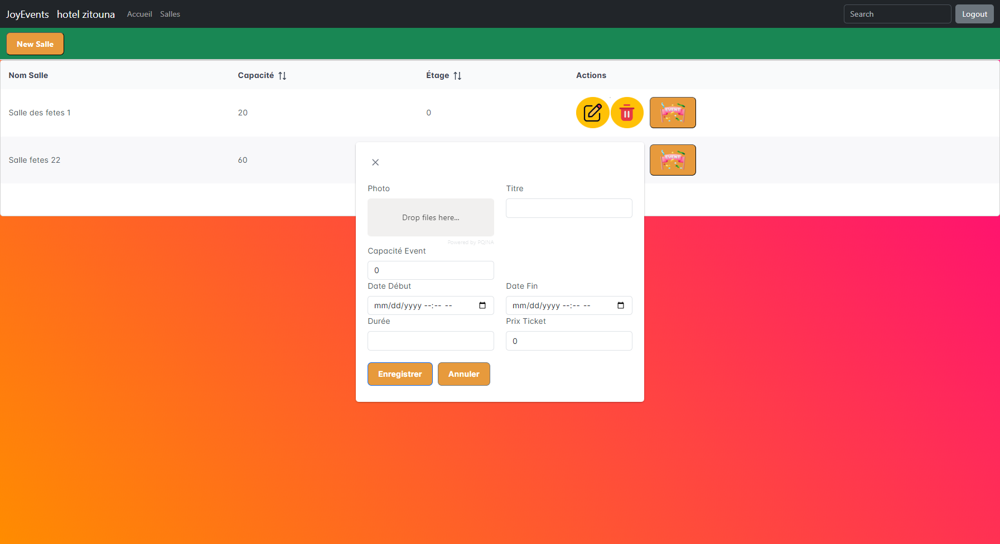

This project integrates **Laravel** with **Vue.js** to build a powerful web application that combines a robust backend with a dynamic frontend.
**Laravel** handles server-side logic, database management, and API endpoints, while **Vue.js** provides an interactive and responsive user interface.
Key features include dynamic management of hotels and rooms, with user-friendly forms for adding, editing, and deleting entries.
The application showcases its functionality through various components and real-time data interactions, ensuring a smooth user experience.

**Screenshots**:
1. **Home Page**: Displays the main interface of the application.

2. **Register with Hotel or Client**: The registration page for hotels or clients.

3. **Login as Hotel or Client**: Login interface for hotels or clients.

4. **Client Interface to Look for Salles de Fête à Réserver**: The page where clients can search for event rooms.

5. **Page de Réservation**: Reservation page for booking rooms.

6. **Interface Hôtel pour Voir ses Salles avec Bouton pour Ajouter des Événements**: Hotel interface to view its rooms with a button to add events.

7. **Pop-up pour Ajouter un Événement**: Pop-up for adding an event.


**Setup Instructions**:
1. **Clone the Repository**:
```bash
git clone https://github.com/your-username/your-repo.git
cd your-repo
```
2. **Backend (Laravel)**:
   - Install Laravel dependencies:
     ```bash
     composer install
     ```
   - Run database migrations:
     ```bash
     php artisan migrate
     ```
   - Start the Laravel server:
     ```bash
     php artisan serve
     ```
3. **Frontend (Vue.js)**:
   - Install Vue.js dependencies:
     ```bash
     npm install
     ```
   - Start the Vue development server:
     ```bash
     npm run dev
     ```

**Usage**:
- Access the Laravel backend at: `http://localhost:8000`
- Access the Vue.js frontend at: `http://localhost:5173`
